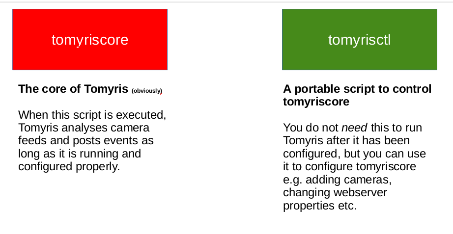
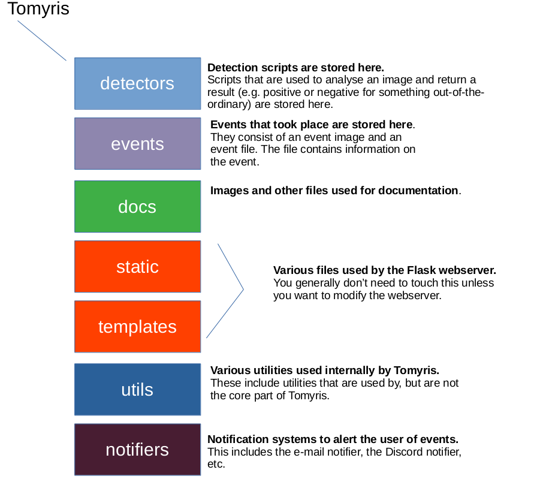
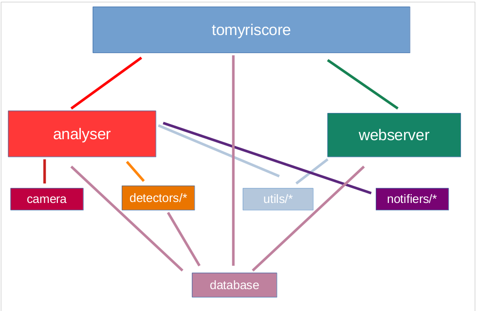

# Tomyris
Named after an ancient Messagetean queen, Tomyris is an intelligent camera feed analyser with a web interface. 

That being said, it's a camera *feed* analyser. It just analyses feeds, detects things that 
are out of the ordinary and notifies you. It's not a  complete DVR/NVR solution, meaning it doesn't record feeds at all.

Features include:

- Intelligent object detection (procedural to minimise CPU usage) (ETA: soon)
- Password-protected minimalistic web interface (ETA: soon)
- Easy-to-use CLI-based interactive configuration tool (ETA: soon)
- ALPR, OCR and pedestrian detection (ETA: soon)
- Support for custom notifiers and detectors, alongside pre-implemented ones (ETA: soon)

## Components

At the very basic level, Tomyris contains *tomyriscore* and *tomyrisctl*:

*tomyrisctl* is an interactive command-line tool used to configure Tomyris.

## Installation

Ensure Python 3.7 or newer is installed. Older versions may work, but are unsupported.
MySQL 15.0 or newer is recommended for the database.

### On Linux (systemd)
> This is the recommended method if you have systemd installed.

Run [`install.sh`](https://raw.githubusercontent.com/UltraFuture7000/Tomyris/master/install.sh) with root privileges if you wish to install Tomyris as a systemd service.
You do not need to clone the repository for this.

This should walk you through everything.

After installation, Tomyris' files will reside in ``/opt/tomyris`` and you can use the command ``tomyrisctl`` in any directory.

### Other operating systems/no systemd

On other operating systems, or if you're rebellious/can't use systemd, get ready; things are a little rougher.

You'll need to clone the repository first.

First, run ``pip install -r requirements.txt`` to install Tomyris' requirements.

Then, run ``python tomyriscore.py`` once to allow it to generate the configuration file.

Next, fill in `config.txt` with your database information (example below).

Run ``python tomyriscore.py``. It will then attempt to connect and if connection is successful, it will encrypt your credentials.

Tomyris should now be installed. You'll need to run ``python tomyriscore.py`` manually for as long as you want Tomyris to operate.
Every time you wish to run tomyrisctl, you must run ``tomyrisctl.py`` with Python and that'll open up tomyrisctl for you.

## Configuration
If you used the install script:
- Run `tomyrisctl` in the terminal (in any directory).

Otherwise:

- Run `tomyrisctl.py` with Python.

### All good?

Check if there are any errors.

If there are, go to Troubleshooting below.
If not, continue reading.

### Change default web password

The default web password is ``admin``. It is highly recommended you change this.

To change it, type ``web passwd [password]``, where ``[password]`` is the new password you wish to use.

### Adding your first camera
Run ``camera add [name] [URL]`` where `[name]` and `[URL]` are a user-defined 
name and feed URL (e.g. rtsp://192.168.178.20/ch04) respectively.

Repeat this process for every camera you wish to add.

### Adding vertical exclusion zones (optional)

Tomyris currently only supports excluding a vertical portion of the image for analysis.
If you need more advanced functionality, feel free to make a pull request or use a post-processor.

``camera exclzone add [name] [denominator]`` 

For example, if 2 is typed for ``[denominator]``, only the bottom half of the image will be analysed.
If 4 is typed, 1/4 of the image (bottom quarter) will be analysed.

### Configure detectors (optional)

Detectors are scripts that can detect images that are out-of-the-ordinary.

Type ``detector list`` to list all available detectors.

If you wish to disable one, type ``detector disable [name]``, where `[name]` is the name of the detector.

If not, read on.

### Allow passwordless login for users on the same network (optional, not recommended)

> This can be a massive security risk!

Type ``web acl-samenet allow``.
To reverse this, type ``web acl-samenet deny``.

### Change webserver port (optional)

By default, the webserver runs on port 80.

Some users prefer encrypted connections to their webserver, which is fine; just run ``web port 443``.

Just don't forget to have ``cert.pem`` and ``key.pem`` in Tomyris' directory (if installed through the script, ``/opt/tomyris``.)

### That's it!

Tomyris should now be configured. 

You should be able to visit the webserver on ``[machine's IP address]:80`` (e.g ``127.0.0.1:80``).

To view events, click the bell once logged in to the webserver.

## Troubleshooting

> Help! tomyrisctl says "Unable to connect to the database!" and/or I can't visit the webpage!

First, ensure a SQL server installed and the credentials you entered earlier were correct.

If you used the install script:
- Run `journalctl -u tomyris` to check for errors.

Otherwise:

- Check `tomyris.log` for errors.

## Structure

## Import chain
> This will be changed to a UML dependency diagram soon.

